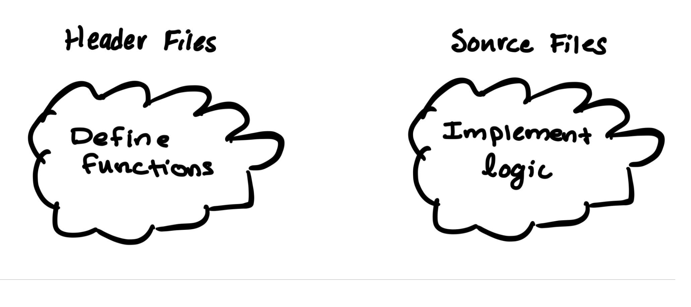
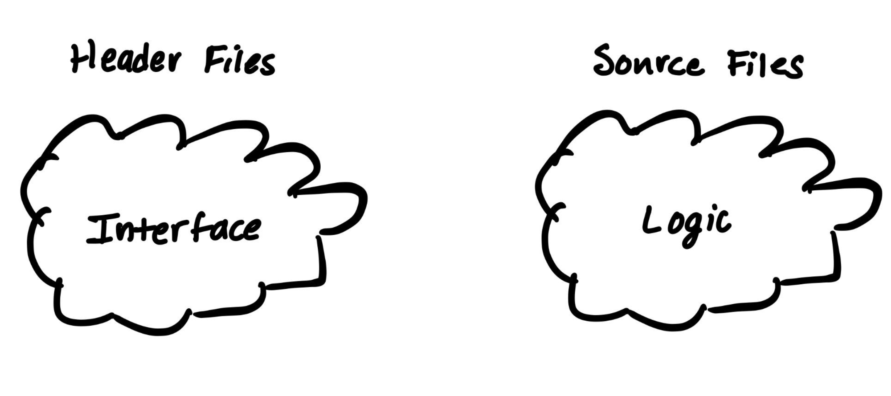
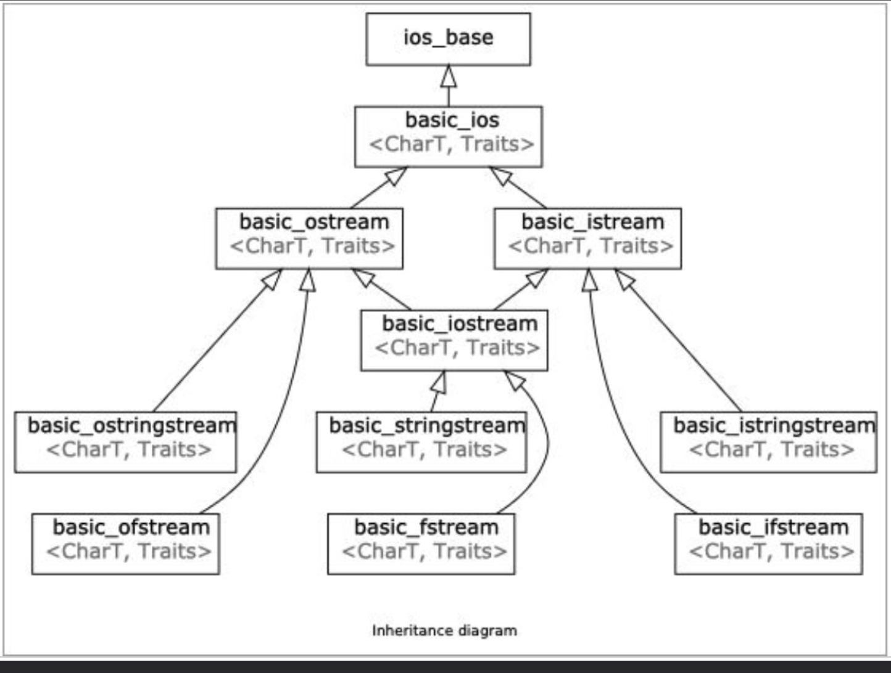

# 类

*该笔记基于课程CS106L的学习，用于记录一些cpp的重要特性以及先前不曾了解的cpp特性。*

## 成员访问

在C++中，使用类时需要为其成员配置访问等级权限。访问等级分为三级：`public`、`protected`、`private`。

- `public`（公有）表示该成员可由该类的对象直接访问，通常用于向外部提供类的接口。

- `protected`（保护）表示该成员在类的外部只能由该类的派生类（子类）访问，用于类的继承，允许派生类进行合理的扩展。

- `private`（私有）表示该成员只能在类的内部访问，在类的外部（包括派生类）都是不可访问的，这通常用于隐藏类的内部数据和实现细节，防止外部直接访问和修改，以保证类的稳定性与安全性。

!!! note "`Class` VS `Struct`"
    类成员的访问操作与结构体类似，但二者的区别在于类的成员具有严格的访问权限设置，而结构体的成员没有。使用类成员的访问权限等级进行类比，结构体成员的访问权限等级都是`public`。

## 定义类

### 多文件（`.h`&`.cpp`）

**头文件（`.h`/`.hpp`）**

- 用于定义类并存放它的接口

- 内容上包含：

    - 函数（类方法）原型

    - 变量（类成员变量）声明

    - 类定义

    - 类型定义

    - 宏和常量

    - 模板定义

!!! note
    有关类模板的介绍，移步[Class Templates | CS106L-TextBook](https://cs106l.github.io/textbook/templates/class-templates)

**源文件（`.cpp`）**

- 用于存放头文件中声明的类方法和类定义的实现

- 内容上包含：

    - 函数（类方法）实现

    - 可执行代码

简单来说，头文件用于定义类的结构，源文件用于实现类的定义细节。





*以上图片来源于[CS106L](https://web.stanford.edu/class/cs106l/)的课程幻灯片。*

### 设计类

一个类的大致包含以下几个模块：

- **构造函数（Constructor）**

- **私有成员变量/函数**

- **公有成员变量/函数**

- **析构函数（Destructor）**

#### 构造器（Constructor）

**构造器/构造函数**用于在创建类的新对象时初始化该对象的状态。

假设我们想实现一个`Student`类，我们可以这样定义：

Header File:
```cpp
class Student {
private:
    std::string name;
    long int id;
    int age;

public:
    // constructor
    Student(std::string name, long int id, int age);
    // memeber methods
    std::getName();
    long int getID();
    int getAge();
};
```
Source File:
```cpp
#include "Student.h"
#include <string>

// implement constructor
Student::Student(std::string name, long int id, int age) {
    this->name = name;
    this->id = id;
    this->age = age;
}
```

注意在源文件中实现类方法时需要在函数名前添加它的`namespace`（命名空间），通常是类的名称。

自C++11起，构造器支持使用**列表初始化**：

```cpp
Student::Student(std::string name, long int id, int age) name{name}, id{id}, age{age} {}
```

对于构造函数，我们还能定义其**默认构造**方式：

```cpp
// defualt constructor
Student::Student() name{"virtualguard"}, id{100100101}, age{18} {}

// overload by parameterized constructor
Student::Student(std::string name, long int id, int age) name{name}, id{id}, age{age} {}
```

#### 析构函数

在C++中，析构函数用于在对象生命周期结束时执行清理工作，是对象生命周期中的重要部分。

析构函数不需要显示调用，它会在对象离开其作用范围时自动调用。

析构函数的语法如下：
```cpp
Student::~Student() {
    // free/deallocate any data here

    delete [] some_array; // for illastration
}
```

## 类继承

下图展示的是`stream`的继承关系。



*以上图片来源于[CS106L](https://web.stanford.edu/class/cs106l/)的课程幻灯片。*

针对继承在面向对象编程中的作用与使用思想，课程[CS61A | UC Berkeley](https://cs61a.org/)有详尽的讲解，这里直接看示例。

以几何图形的定义与性质为例：

Header File:
```cpp
class Shape {
public:
    // virtual function
    virtual double area() const = 0;
};

class Circle: public Shape {
public:
    Circle(double radius): _radius{radius} {};
    double area() const {
        return M_PI * _radius * radius;
    }
private:
    // private members are marked by '_'
    double _radius;
};

class Rectangle: public Shape {
public:
    Rectangle(double width, double height): _height{height}, _width{width} {};
    double area() const {
        return _width * _height;
    }
private:
    double _width, _height;
}
```

## 杂项

### 类型别名

允许用户为现有类型创建别名。一般有两种方式：

#### `typedef`

```cpp
// typedef [origin] [aliasing]
typedef int Integer;
typedef double Real;
```

#### `using`

使用`using`关键字进行类型别名定义是C++11引入的一个特性。第一节的学习中我们就有用到它。
```cpp
// using [aliasing] [origin]
using String = std::string;
using quadratic = std::pair<bool, std::pair<double, double>>;
```

## 类模板


